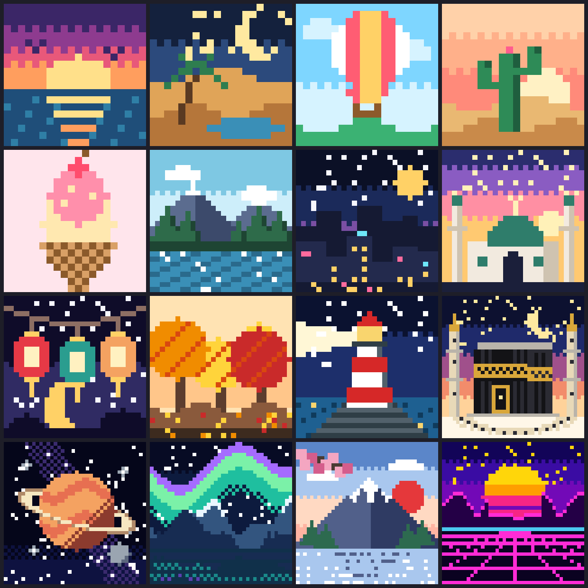

# PixelHue

Mobile-first color-by-number pixel-art game. One HTML file, no build step, no dependencies. Open `index.html`.

- Dashboard: overall progress ring, stats, daily streak, Continue card
- 16 levels: Easy (20x20), Medium (28x28), Hard (40x40), star ratings by accuracy
- Tools: tap/drag paint, magic Fill bucket, Undo, Hint, Peek, pan/zoom
- Settings: vibration, auto-next color, light/dark/auto theme
- Progress saved in localStorage

